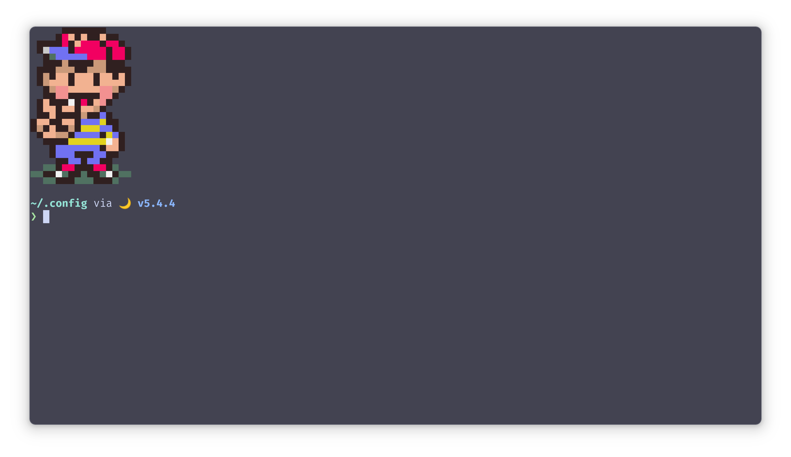

## 🚋 installation

```shell
$ curl -sS https://github.com/bennypowers/dotfiles/blob/master/.cfg-install.sh | sh
```

## 📺 bunkum

[🐟 fish shell](./.config/fish/),
[✨ neovim](./config/nvim/),
[🖌️ colorscripts](./.config/colorscripts/),
